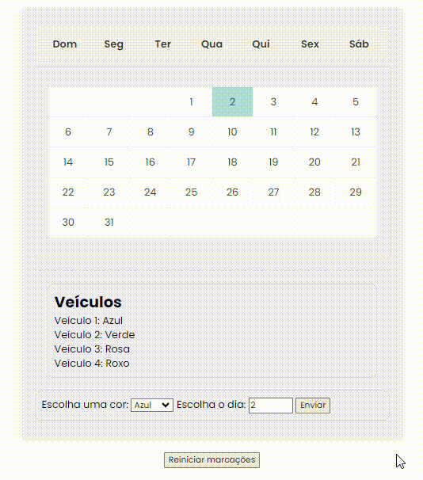

## Calendário de Veículos - Agendamento e Codificação por Cores
Projeto desenvolvido em html, javascript e css.
## Índice
* [Descrição](#descrição)
* [Introdução](#introdução)
* [Funcionalidades](#funcionalidades)
* [Técnicas e tecnologias utilizadas](#técnicas-e-tecnologias-utilizadas)
* [Fontes Consultadas](#fontes-consultadas)

## Descrição
* Este arquivo HTML representa a estrutura básica de um calendário web. Ele exibe um calendário mensal com os dias da semana, datas e uma seção para seleção de cores e datas que serão essenciais para o real motivo do projeto, que são agendamentos para uma empresa de fretes. 

## Introdução
* Seja bem-vindo ao calendário web! Este projeto demonstra a estrutura básica de um calendário mensal com funcionalidades interativas desenvolvidas com JavaScript.

**O que você pode fazer:**

- Visualizar um calendário mensal completo com os dias da semana e datas.
- Selecionar cores e datas, com uma restrição de três dias por cor.
- Visualizar as devidas cores de cadas veículos. 

## Funcionalidades
- Exibição do calendário mensal: A página exibe um calendário mensal com os dias da semana e as datas dos dias do mês. 
- Existe uma seção com um menu para escolher cores e um campo para selecionar o dia, com isso colorindo o dia agendado.
- Seção de veículos (informativa): Há uma seção informativa que lista veículos com cores associadas (Azul, Verde, Rosa, Roxo). Esta seção não possui interatividade.

## Técnicas e tecnologias utilizadas
* [<code></code>](https://developer.mozilla.org/pt-BR/docs/Web/HTML)
* [<code></code>](https://developer.mozilla.org/pt-BR/docs/Web/CSS)
* [<code></code>](https://developer.mozilla.org/pt-BR/docs/Web/JavaScript)
* [<code></code>](https://git-scm.com/)
* [<code></code>](https://bard.google.com/chat?hl=pt)
* [<code></code>](https://code.visualstudio.com/)
* [<code></code>](https://github.com/)

## Fontes consultadas 
* [Alura - Como escrever um bom README.md](https://www.alura.com.br/artigos/escrever-bom-readme)
* [Bootstrap](https://getbootstrap.com/docs/5.3/forms/checks-radios/#radios)
* [Alura - Tipos de type](https://cursos.alura.com.br/forum/topico-type-do-campo-telefone-104370)
* [Dio](https://www.dio.me/articles/tutorial-criando-um-readme-bonitao-para-o-seu-github)
* [Progamador alternativo - Youtube](https://youtu.be/HJ16WEmOWTw?si=UFvCAtBHbuCc08Hu)
* [Fotos para o subtópico "Técnicas e tecnologias consultadas"](https://github.com/alexandresanlim/Badges4-README.md-Profile)

## Autor(a)
|  [ Ana Santos](https://github.com/AnaLu1za) |  
| :---: |

[<code></code>](https://www.linkedin.com/posts/ana-luiza-santos-a5032a2a2_github-analu1zacalendario-activity-7181609216594362368-L0ck?utm_source=share&utm_medium=member_desktop&classId=0957c4cc-ef7e-4a5a-9f0e-dd51c581416f&assignmentId=cc9b78ea-57be-4ad0-9681-cb7e4f2dcf2f&submissionId=723a32cd-89b3-e400-9d53-b09d)

